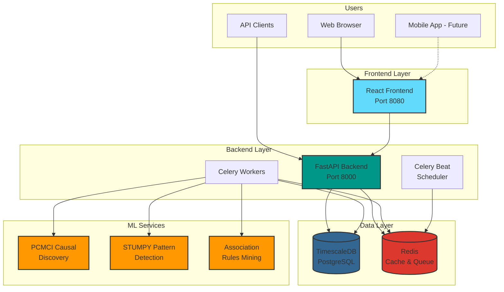
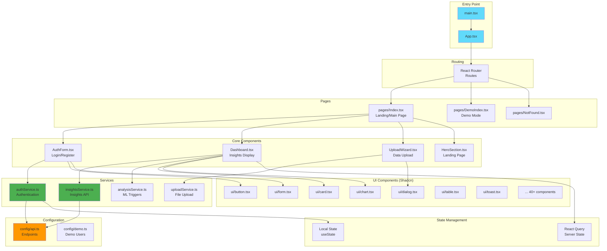
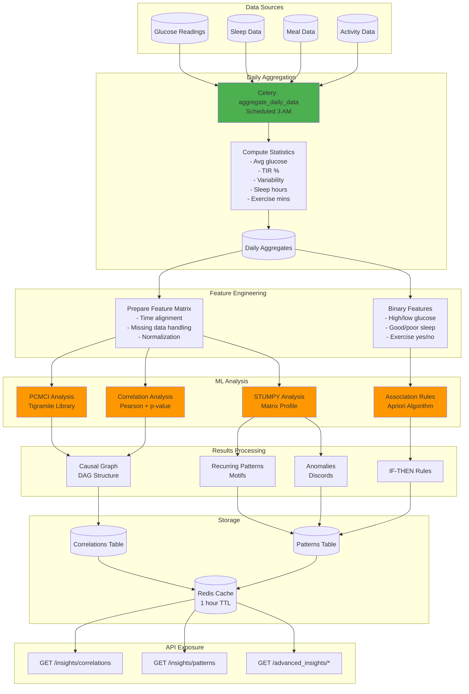
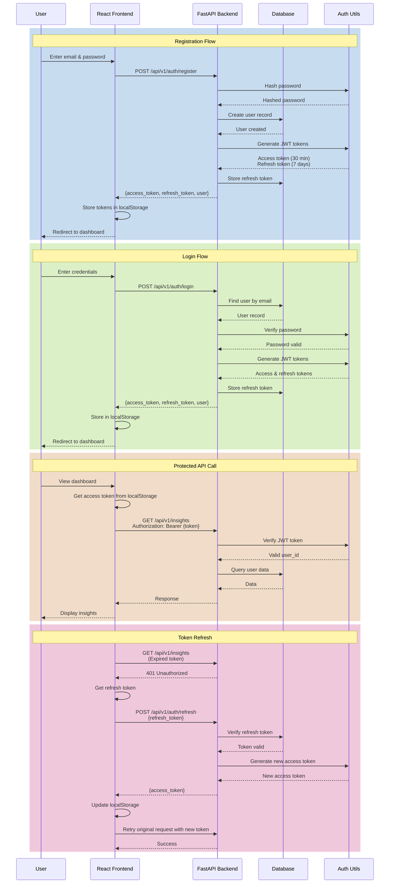
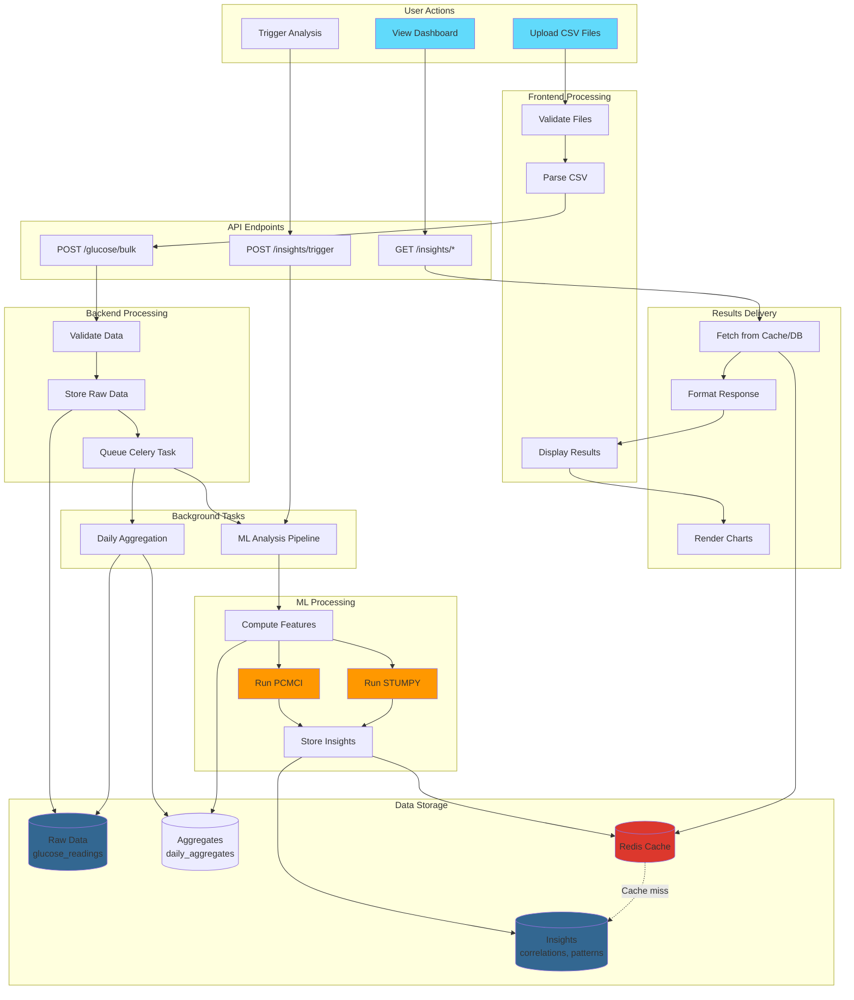
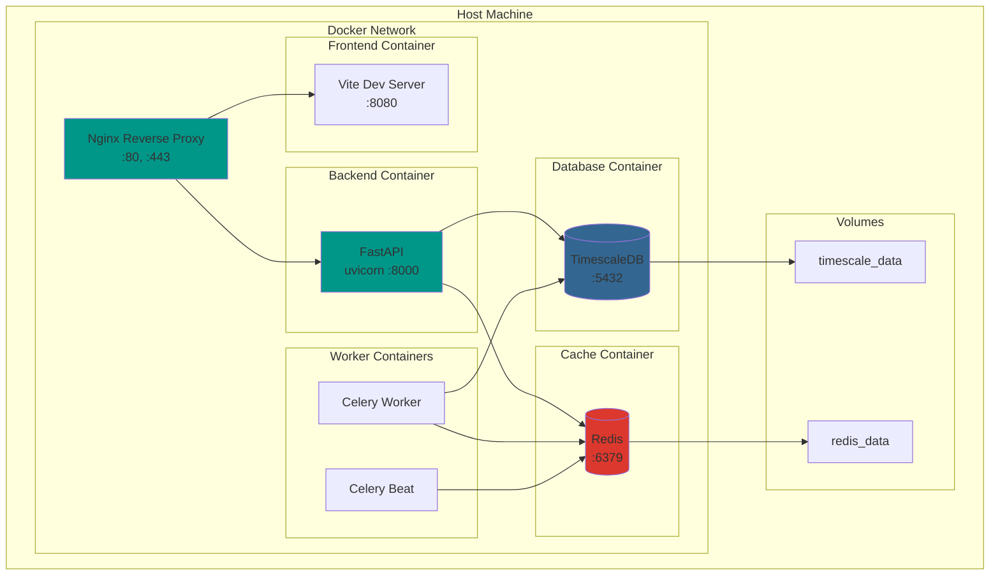
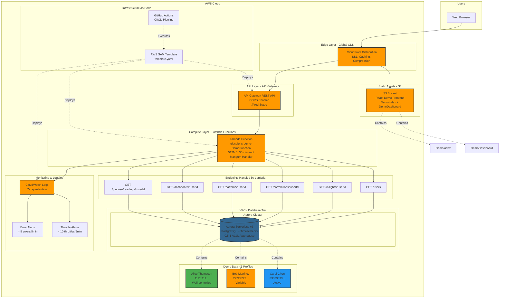
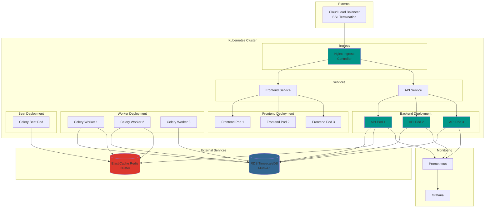

# GlucoLens Architecture Diagrams

Comprehensive Mermaid diagrams for all components and their integrations.

---

## Table of Contents

1. [High-Level System Overview](#1-high-level-system-overview)
2. [Component Integration](#2-component-integration)
3. [Backend Architecture](#3-backend-architecture)
4. [Frontend Architecture](#4-frontend-architecture)
5. [ML Pipeline Architecture](#5-ml-pipeline-architecture)
6. [Database Schema](#6-database-schema)
7. [Authentication Flow](#7-authentication-flow)
8. [Data Flow](#8-data-flow)
9. [Deployment Architecture](#9-deployment-architecture)

---

## 1. High-Level System Overview



---

## 2. Component Integration

```mermaid
graph LR
    subgraph "Frontend Components"
        AUTH_UI[AuthForm]
        DASH[Dashboard]
        UPLOAD[UploadWizard]
        CHARTS[Charts & Viz]
    end

    subgraph "Frontend Services"
        AUTH_SVC[authService]
        INSIGHTS_SVC[insightsService]
        UPLOAD_SVC[uploadService]
        ANALYSIS_SVC[analysisService]
    end

    subgraph "API Layer"
        AUTH_API[/api/v1/auth]
        GLUCOSE_API[/api/v1/glucose]
        INSIGHTS_API[/api/v1/insights]
        ADV_INSIGHTS_API[/api/v1/advanced_insights]
        HEALTH_API[/api/v1/health_metrics]
    end

    subgraph "Backend Services"
        PCMCI_SVC[PCMCI Service]
        STUMPY_SVC[STUMPY Service]
        CORR_SVC[Correlation Service]
    end

    subgraph "Background Tasks"
        AGG_TASK[Daily Aggregation]
        CORR_TASK[Correlation Analysis]
        PATTERN_TASK[Pattern Discovery]
        ML_TASK[ML Analysis]
    end

    subgraph "Data Storage"
        USERS_DB[(Users)]
        GLUCOSE_DB[(Glucose Readings)]
        INSIGHTS_DB[(Correlations<br/>Patterns)]
        AGG_DB[(Daily Aggregates)]
    end

    AUTH_UI --> AUTH_SVC
    DASH --> INSIGHTS_SVC
    UPLOAD --> UPLOAD_SVC
    DASH --> ANALYSIS_SVC

    AUTH_SVC --> AUTH_API
    INSIGHTS_SVC --> INSIGHTS_API
    INSIGHTS_SVC --> ADV_INSIGHTS_API
    UPLOAD_SVC --> GLUCOSE_API
    ANALYSIS_SVC --> ADV_INSIGHTS_API

    AUTH_API --> USERS_DB
    GLUCOSE_API --> GLUCOSE_DB
    INSIGHTS_API --> INSIGHTS_DB
    ADV_INSIGHTS_API --> PCMCI_SVC
    ADV_INSIGHTS_API --> STUMPY_SVC

    AGG_TASK --> GLUCOSE_DB
    AGG_TASK --> AGG_DB
    CORR_TASK --> AGG_DB
    CORR_TASK --> PCMCI_SVC
    PATTERN_TASK --> AGG_DB
    ML_TASK --> PCMCI_SVC
    ML_TASK --> STUMPY_SVC

    PCMCI_SVC --> INSIGHTS_DB
    STUMPY_SVC --> INSIGHTS_DB
    CORR_SVC --> INSIGHTS_DB

    style AUTH_UI fill:#61dafb
    style DASH fill:#61dafb
    style UPLOAD fill:#61dafb
    style PCMCI_SVC fill:#ff9800
    style STUMPY_SVC fill:#ff9800
```

---

## 3. Backend Architecture

```mermaid
graph TB
    subgraph "FastAPI Application"
        MAIN[main.py<br/>FastAPI App]
        DEPS[dependencies.py<br/>Auth & DB]
        CONFIG[config.py<br/>Settings]
    end

    subgraph "API Routes"
        AUTH_ROUTE[routes/auth.py]
        GLUCOSE_ROUTE[routes/glucose.py]
        SLEEP_ROUTE[routes/sleep.py]
        MEALS_ROUTE[routes/meals.py]
        ACTIVITIES_ROUTE[routes/activities.py]
        INSIGHTS_ROUTE[routes/insights.py]
        ADV_INSIGHTS_ROUTE[routes/advanced_insights.py]
        HEALTH_ROUTE[routes/health_metrics.py]
    end

    subgraph "Pydantic Schemas"
        AUTH_SCHEMA[schemas/auth.py]
        GLUCOSE_SCHEMA[schemas/glucose.py]
        INSIGHTS_SCHEMA[schemas/insights.py]
    end

    subgraph "Database Models"
        USER_MODEL[models/user.py]
        GLUCOSE_MODEL[models/glucose.py]
        SLEEP_MODEL[models/sleep.py]
        CORR_MODEL[models/correlation.py]
        PATTERN_MODEL[models/pattern.py]
        AGG_MODEL[models/aggregate.py]
    end

    subgraph "ML Services"
        PCMCI_SERVICE[services/pcmci_service.py<br/>Causal Discovery]
        STUMPY_SERVICE[services/stumpy_service.py<br/>Pattern Detection]
    end

    subgraph "Utilities"
        AUTH_UTIL[utils/auth.py<br/>JWT & Password]
    end

    subgraph "Background Tasks"
        TASKS[tasks.py<br/>Aggregation, Correlation]
        TASKS_ML[tasks_ml.py<br/>PCMCI, STUMPY]
    end

    subgraph "Database"
        DB[(TimescaleDB)]
    end

    MAIN --> AUTH_ROUTE
    MAIN --> GLUCOSE_ROUTE
    MAIN --> INSIGHTS_ROUTE
    MAIN --> ADV_INSIGHTS_ROUTE

    AUTH_ROUTE --> AUTH_SCHEMA
    AUTH_ROUTE --> USER_MODEL
    AUTH_ROUTE --> AUTH_UTIL

    GLUCOSE_ROUTE --> GLUCOSE_SCHEMA
    GLUCOSE_ROUTE --> GLUCOSE_MODEL

    ADV_INSIGHTS_ROUTE --> PCMCI_SERVICE
    ADV_INSIGHTS_ROUTE --> STUMPY_SERVICE

    TASKS --> AGG_MODEL
    TASKS --> CORR_MODEL
    TASKS_ML --> PCMCI_SERVICE
    TASKS_ML --> STUMPY_SERVICE

    USER_MODEL --> DB
    GLUCOSE_MODEL --> DB
    CORR_MODEL --> DB
    PATTERN_MODEL --> DB

    DEPS --> AUTH_UTIL
    DEPS --> DB

    style MAIN fill:#009688
    style PCMCI_SERVICE fill:#ff9800
    style STUMPY_SERVICE fill:#ff9800
    style DB fill:#336791
```



---

## 4. Frontend Architecture



---

## 5. ML Pipeline Architecture



---

## 6. Database Schema

```mermaid
erDiagram
    USER ||--o{ GLUCOSE_READING : has
    USER ||--o{ SLEEP_DATA : has
    USER ||--o{ MEAL : has
    USER ||--o{ ACTIVITY : has
    USER ||--o{ DAILY_AGGREGATE : has
    USER ||--o{ CORRELATION : has
    USER ||--o{ PATTERN : has
    USER ||--o{ HBA1C : has
    USER ||--o{ MEDICATION : has
    USER ||--o{ INSULIN_DOSE : has
    USER ||--o{ REFRESH_TOKEN : has

    USER {
        uuid id PK
        string email UK
        string hashed_password
        string full_name
        int age
        string gender
        string diabetes_type
        date diagnosis_date
        timestamp created_at
    }

    GLUCOSE_READING {
        int id PK
        uuid user_id FK
        timestamp timestamp
        float value
        string source
        timestamp created_at
    }

    SLEEP_DATA {
        int id PK
        uuid user_id FK
        date date
        timestamp sleep_start
        timestamp sleep_end
        int deep_sleep_minutes
        int rem_sleep_minutes
        int light_sleep_minutes
        float quality_score
    }

    MEAL {
        int id PK
        uuid user_id FK
        timestamp timestamp
        string meal_type
        float carbs_grams
        float protein_grams
        float fat_grams
        int calories
        float glycemic_load
        text description
    }

    ACTIVITY {
        int id PK
        uuid user_id FK
        timestamp timestamp
        string activity_type
        int duration_minutes
        string intensity
        int calories_burned
        int avg_heart_rate
    }

    DAILY_AGGREGATE {
        int id PK
        uuid user_id FK
        date date UK
        float avg_glucose
        float min_glucose
        float max_glucose
        float std_glucose
        float time_in_range_pct
        int total_sleep_minutes
        int total_exercise_minutes
        float total_carbs_grams
    }

    CORRELATION {
        int id PK
        uuid user_id FK
        string factor_x
        string factor_y
        float correlation
        float p_value
        float abs_correlation
        int time_lag_days
        timestamp created_at
    }

    PATTERN {
        int id PK
        uuid user_id FK
        string pattern_type
        text description
        float confidence
        float support
        jsonb metadata
        timestamp created_at
    }

    HBA1C {
        int id PK
        uuid user_id FK
        date test_date
        float value_percent
        string lab_name
    }

    MEDICATION {
        int id PK
        uuid user_id FK
        string name
        string dosage
        string frequency
        boolean is_active
        date start_date
        date end_date
    }

    INSULIN_DOSE {
        int id PK
        uuid user_id FK
        timestamp timestamp
        string insulin_type
        float units
        string dose_type
    }

    REFRESH_TOKEN {
        int id PK
        uuid user_id FK
        string token UK
        timestamp expires_at
        boolean is_revoked
    }
```



---

## 7. Authentication Flow



---

## 8. Data Flow



---

## 9. Deployment Architecture

### 9.1 Docker Compose (Development/MVP)



### 9.2 AWS Lambda (Read-Only Demo Deployment)

**Purpose:** Serverless read-only demo with pre-loaded data (3 demo users, 90 days of synthetic data)

**Key Features:**
- No authentication required (demo mode)
- GET endpoints only (read-only)
- Pre-computed ML insights (PCMCI, STUMPY, association rules)
- Global CDN distribution via CloudFront
- Auto-scaling with Lambda
- Cost: ~$50/month (optimizable to $15-20)



**Data Flow:**
1. User visits demo URL (CloudFront)
2. CloudFront serves React frontend from S3
3. User selects demo profile (Alice/Bob/Carol)
4. Frontend calls API Gateway endpoints
5. API Gateway triggers Lambda function
6. Lambda queries Aurora Serverless for demo data
7. Pre-computed insights returned to frontend
8. Dashboard renders with charts and visualizations

**Deployment Steps:**
1. `sam build --use-container` (Build Lambda package)
2. `sam deploy` (Deploy infrastructure)
3. `python scripts/generate_demo_users.py` (Generate demo data)
4. `npm run build` (Build frontend with `VITE_DEMO_MODE=true`)
5. `aws s3 sync dist/ s3://bucket/` (Deploy frontend)
6. `aws cloudfront create-invalidation` (Clear CDN cache)

See `AWS_DEPLOYMENT_CHECKLIST.md` for full deployment guide.

### 9.3 Kubernetes (Production Scale)



---

## Component Legend

**Colors:**
- 🔵 **Blue (#61dafb)** - Frontend components
- 🟢 **Green (#009688)** - Backend API/servers
- 🔴 **Red (#dc382d)** - Redis/caching
- 🟣 **Purple (#336791)** - Databases
- 🟠 **Orange (#ff9800)** - ML services/AWS services
- 🟢 **Green (#4caf50)** - Services/utilities

**Shapes:**
- Rectangle - Components/services
- Cylinder - Databases/storage
- Circle - External services
- Diamond - Decision points

---

## Using These Diagrams

1. **For Development:** Reference component diagrams to understand code organization
2. **For Deployment:** Use deployment diagrams to set up infrastructure
3. **For Documentation:** Copy diagrams into presentations or technical docs
4. **For Onboarding:** Walk new team members through the architecture

---

## Updating Diagrams

When adding new features:
1. Update relevant component diagram
2. Update integration diagram if new connections
3. Update data flow if new data paths
4. Regenerate from this markdown file

All diagrams use Mermaid syntax and render automatically on GitHub, GitLab, and most documentation platforms.

---

**Last Updated:** 2025-01-15
**Maintained By:** Development Team
